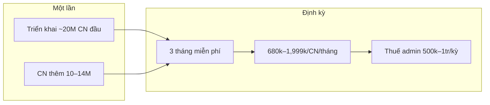

# Linm F&B — Phân tích mô hình thuê (A · Linm hosting)

> **Phạm vi:** Rủi ro & lợi nhuận mô hình **triển khai + thuê theo tháng** (§4b `09-PRICING-PROPOSAL.md`).  
> **Không công khai khách hàng** — nội bộ sales / vận hành / quyết định giá.  
> Cập nhật: 2026-06-07 (§11 định giá CN vs chứng từ · hybrid trên 1 platform).

---

## 1. Tóm tắt điều hành

| Câu hỏi | Kết luận |
|---------|----------|
| Mô hình thuê có khả thi? | **Có** — nhờ phí triển khai + MRR; tốt nhất từ **5+ CN** trên cùng nền |
| Gói nên ưu tiên? | **Tiêu chuẩn 999k/CN/tháng** — gói 680k cho quán &lt;10 bàn |
| Rủi ro lớn nhất? | **Churn sau 3 tháng miễn phí** · giá flat khi quán quá lớn |
| Rủi ro storage ảnh CK? | **Đã giảm** — cap 30 ngày + lưu `bank_transaction_ref` vĩnh viễn |
| Break-even nền tảng (chỉ MRR)? | ~**6–8 CN** @ 999k (ước lượng chi nền ~4–5 triệu/tháng) |
| **Thuê theo CN hay theo chứng từ?** | **Hybrid:** phí nền **/CN/tháng** + **quota order** + phụ thu vượt mức (§11) |

---

## 2. Mô hình kinh doanh



| Dòng thu | Mức giá | Ghi chú |
|----------|---------|---------|
| Triển khai CN đầu | ~20 triệu | 50% ký — 50% go-live |
| CN thêm (cùng NG/quy mô) | ~10–14 triệu | Giảm 30–50% |
| Duy trì (từ tháng 4) | 680k / 999k / 1,999k / CN / tháng | Min 3 tháng; trả 12 → dùng 13 |
| Pilot | 3 tháng hosting + support miễn phí | Chi phí Linm trước recurring |
| Upsell | Khai thuế 500k–1tr/kỳ | Tách phí F&B |
| Upsell dài hạn | Linm ERP | Báo giá riêng — `09-PRICING-PROPOSAL.md` §9 |

**Đặc điểm:** doanh thu **lumpy** (setup) + **MRR mỏng**; giai đoạn đầu **subsidize** 3 tháng hosting.

SSOT báo giá khách: `09-PRICING-PROPOSAL.md` · `pricing.html#deploy`

---

## 3. Cấu trúc chi phí (ước lượng nội bộ)

### 3.1 Chi phí cố định nền tảng (shared cluster)

| Hạng mục | Ước lượng/tháng | Ghi chú |
|----------|-----------------|---------|
| Cloud/VPS + PostgreSQL | 2–4 triệu | Multi-tenant pilot ~10–20 CN |
| Backup, monitoring, object storage | 0,5–1 triệu | Ảnh CK cap 30 ngày → ~1,5–2 GB/CN rolling |
| Auth, Notification, domain | 0,5–1 triệu | Dùng chung tenant |
| **Tổng nền** | **~3–6 triệu/tháng** | Trước phân bổ/CN |

### 3.2 Chi phí biến đổi / CN / tháng

| Hạng mục | Ước lượng |
|----------|-----------|
| DB + bandwidth + SignalR | 150–250k |
| Backup phân bổ | 30–50k |
| Hỗ trợ Zalo (giờ hành chính) | 150–400k |
| **Tổng biến đổi/CN** | **~200–450k** |

### 3.3 COGS triển khai (~20M CN đầu)

| Hạng mục | Ước lượng |
|----------|-----------|
| Khảo sát, menu, QR, training onsite | 6–10 triệu |
| Deploy tenant | 1–2 triệu |
| Dự phòng sau pilot | 1–2 triệu |
| **COGS triển khai** | **~8–12 triệu (~40–60% doanh thu)** |
| **Biên gộp setup CN đầu** | **~8–12 triệu** |

CN thêm (10–14M): COGS ~4–7M → biên gộp setup **~50–65%**.

---

## 4. Unit economics — duy trì theo gói

Sau 3 tháng miễn phí; giả định khách ở lại ≥12 tháng.

| Gói | Thu/CN/tháng | Chi biến đổi (TB) | Biên gộp recurring/CN | Biên % |
|-----|--------------|-------------------|------------------------|--------|
| Cơ bản | 680k | ~350k | **~330k** | ~49% |
| Tiêu chuẩn ★ | 999k | ~350k | **~649k** | ~65% |
| Mở rộng | 1,999k | ~400k | **~1.599k** | ~80% |

Phân bổ chi nền (~4M/tháng ÷ số CN):

| Gói | Sau nền @ 10 CN | Sau nền @ 20 CN |
|-----|-----------------|-----------------|
| 680k | **~−70k** (gần hòa) | **+30k** |
| 999k | **+350k** | **+450k** |
| 1,999k | **+1.350k** | **+1.450k** |

**Gói 680k** cần scale CN hoặc setup fee bù nền tảng. **999k** = điểm cân bằng pilot Lẩu Gà Ngon (10–20 bàn).

---

## 5. P&L kịch bản 12 tháng

### 5.1 Một CN — gói 999k, retention tốt

| Khoản | Số tiền |
|-------|--------|
| Doanh thu setup | 20,0 triệu |
| Recurring (9 tháng trả phí) | 9,0 triệu |
| **Tổng thu năm 1** | **29,0 triệu** |
| COGS setup + vận hành 12 th + support | −18,4 triệu |
| **Lợi nhuận gộp năm 1** | **~10,6 triệu (~37%)** |

### 5.2 Churn sau 3 tháng miễn phí

| Khoản | Số tiền |
|-------|--------|
| Thu setup | 20,0 triệu |
| Recurring | 0 |
| Chi setup + 3 tháng hosting/support | −13,5 triệu |
| **Lợi nhuận** | **~6,5 triệu (one-shot)** — mất LTV ~5–7 triệu/năm |

### 5.3 Chuỗi 5 CN (1×20M + 4×12M), TB 750k/CN

| Khoản | Năm 1 |
|-------|-------|
| Setup | 68 triệu |
| Recurring (9 th × 5 CN × 750k) | 33,75 triệu |
| **Tổng thu** | **~102 triệu** |
| Chi (setup + vận hành + nền) | −69 triệu |
| **Lợi nhuận gộp ước tính** | **~33 triệu (~32%)** |

---

## 6. Ma trận rủi ro

### 6.1 Thương mại

| Rủi ro | Mức | Giảm thiểu |
|--------|-----|------------|
| Churn sau pilot 3 tháng | **Cao** | Min 3 tháng trả phí; KPI go/no-go tháng 4; default gói 999k |
| Gói 680k kéo margin | TB | Giới hạn tính năng; upsell 999k |
| Custom ngoài HĐ | TB | §4b phí phát sinh — báo giá trước |
| Trả 12 tặng 1 | Thấp | Cash flow; giảm churn |
| Cạnh tranh POS rẻ | TB | Đối soát CK + thống kê món + HKD/thuế |

### 6.2 Vận hành & kỹ thuật

| Rủi ro | Mức | Ghi chú |
|--------|-----|---------|
| Storage ảnh CK | **Thấp** | Cap 30 ngày · `08-QR-PAYMENT.md` §6.3 |
| Multi-tenant noisy neighbor | TB | Báo cáo nặng · ca Tết |
| DB `order_lines` tăng | TB | ~580k dòng/năm/CN (40 bàn, ca đông) — index + aggregate |
| SignalR peak | TB | Nhiều bàn × nhiều CN |
| Backup/restore | TB | Cần SLA trong HĐ |
| OCR mã GD fail | Thấp–TB | Nhập tay fallback |

**Ước lượng data (1 CN lẩu ~40 bàn, ~200 session/ngày):**

- ~1.600 `order_lines`/ngày → ~580k/năm/CN  
- Ảnh CK (30 ngày rolling): ~60 MB/ngày peak → **~1,8 GB/CN** ổn định (không ~22 GB/năm như lưu vĩnh viễn)

### 6.3 Tài chính Linm

| Rủi ro | Mô tả |
|--------|--------|
| Subsidize pilot | ~1–1,5M chi/CN trước recurring |
| Flat pricing vs volume | 50 bàn cao điểm vs 15 bàn — cùng giá |
| Bottleneck triển khai | Onsite/training — không phải server |
| R&D chưa amortize | Setup phải gánh đầu tư sản phẩm giai đoạn đầu |

---

## 7. Điểm mạnh mô hình thuê

| Yếu tố | Lợi ích |
|--------|---------|
| MRR tái lặp | 5 CN × 999k ≈ 5M/tháng (~60M/năm) sau ramp |
| Setup cao | Cash + biên ngay; CN thêm margin setup tốt |
| Multi-tenant | Chi/CN giảm khi scale |
| Upsell thuế | ~2–3M/năm/CN (4 kỳ) — margin dịch vụ cao |
| Upsell marketing | Landing + QC theo chương trình — không trong MRR F&B · `09-PRICING-PROPOSAL.md` §10 |
| Cross-sell ERP | Chuỗi có NĐT |
| Prepay 12+1 | Tiền trước · churn thấp hơn |
| Chính sách data ảnh | Chi hosting không phình theo thời gian |

---

## 8. Ngưỡng quy mô

| Quy mô | Đánh giá |
|--------|----------|
| 1–3 CN | Khả thi nhờ setup; recurring chủ yếu bù hosting — **999k+** |
| 5–10 CN | Khỏe — nền amortize |
| 10–20 CN | Tốt — cân nhắc fair-use / CN lớn tách resource |
| 1 CN quá lớn (50+ bàn) | Rủi ro margin — gói Mở rộng hoặc phụ thu |

---

## 9. Khuyến nghị vận hành & hợp đồng

### 9.1 Bảo vệ lợi nhuận

1. Pilot **mặc định gói Tiêu chuẩn 999k** — 680k cho quán &lt;10 bàn, support tối thiểu.  
2. **Checklist go/no-go** trước tháng 4 (sau 3 tháng free).  
3. **Fair use HĐ** (đề xuất chưa có trong báo giá công khai): ≤40 bàn/CN hoặc ≤X đơn/ngày; vượt → nâng gói/phụ thu.  
4. Giữ **ảnh 30 ngày + mã GD vĩnh viễn**.  
5. Pitch **thuế admin** và **marketing** (landing + QC) song song F&B.  
6. Ưu tiên bán **3+ CN/đợt** (setup CN thêm 10–14M).

### 9.2 Chỉ số theo dõi (KPI nội bộ)

- Churn sau tháng 3 / 12  
- Biên gộp/CN/tháng (thu − hosting − support)  
- Giờ support/CN/tháng  
- p95 API báo cáo · GB DB/CN  
- % khách prepay 12 tháng  

### 9.3 Kỹ thuật trước scale

1. Ảnh CK → object storage (không blob DB).  
2. Bảng aggregate ngày/CN cho reports.  
3. Partition/archive `order_lines` theo tháng (sau 12–24 tháng).  
4. Tenant lớn → DB/schema riêng hoặc quota.  
5. Job `ProofImagePurgeJob` — `06-SECURITY-RATELIMIT.md`.

---

## 10. Cam kết công khai (khách hàng — không lộ biên nội bộ)

Đã ghi trong `09-PRICING-PROPOSAL.md` § Dữ liệu & lưu trữ · `pricing.html#deploy`:

- Ảnh biên lai CK: **tối đa 30 ngày**  
- Mã giao dịch: lưu khi xác nhận (app tự trích + nhập tay nếu cần)  
- Đơn / báo cáo doanh thu: metadata lưu theo nhu cầu kế toán quán  

---

## 11. Định giá: theo CN/tháng vs theo chứng từ (1 platform chung)

### 11.1 Bối cảnh platform chung

Mọi đơn vị trên **cùng cluster** Linm → chi phí gồm:

| Loại | Driver | Ai “ăn” nhiều hơn |
|------|--------|-------------------|
| **Cố định** | Nền tảng, Auth, Notification, gateway | Chia đều — cần **tối thiểu MRR/CN** |
| **Biến đổi** | `order_lines`, session đóng, event, SignalR, metadata CK | **Quán cao điểm** — cần **đồng bộ với volume** |

**Đơn vị đo billing (F&B):** **1 lượt quota** = khách **order** (QR bàn) + quán **xác nhận đơn** (`FnB.OrderConfirmedByWaiter` — NV xác nhận → gửi bếp). *Không* tính từng dòng món; *không* tính riêng `PaymentConfirmed`. Tham chiếu quy mô gói: **lượt/bàn/ngày** (TB mỗi bàn mỗi ngày); hóa đơn quota = **tổng lượt/CN/tháng**.

Tách riêng: **dịch vụ khai thuế** đã theo chứng từ/kỳ (`09-PRICING-PROPOSAL.md` §8) — không trộn vào phí hosting F&B.

### 11.2 So sánh 3 mô hình

| Tiêu chí | **A · Flat /CN/tháng** (hiện tại) | **B · Thuần theo chứng từ** | **C · Hybrid ★** |
|----------|-----------------------------------|-----------------------------|------------------|
| Dễ bán HKD/quán | ★★★ | ★ | ★★★ |
| Bảo vệ margin khi quán đông | ★ | ★★★ | ★★★ |
| Doanh thu tháng thấp mùa vắng | Cao (có thể dư) | Thấp (đúng cost) | Vừa (base cover nền) |
| Công bằng trên 1 platform | Kém (CN đông subsidize CN vắng) | Cao | Cao |
| Dự báo cho khách | ★★★ | ★ | ★★ |
| **Lợi nhuận Linm dài hạn** | TB nếu không fair-use | Cao nếu volume lớn | **Cao nhất ổn định** |

**Kết luận:** **Không** chuyển hẳn sang thuần theo chứng từ (khó chốt sales F&B). **Không** giữ flat vô hạn (CN 50 bàn Tết lỗ margin). → **C · Hybrid** = giữ cách nói “**X triệu/tháng/chi nhánh**” + **quota order** trong HĐ + phụ thu mềm khi vượt.

### 11.3 Cấu trúc hybrid đề xuất (thay thế dần bảng §4 công khai)

**Công thức:**

```
Phí tháng/CN = Phí nền gói + max(0, (Lượt_order_xác_nhận − Quota_gói) × Đơn_giá_vượt)
```

| Gói (tên khách) | Phí nền/CN/tháng | Quota / CN / tháng | Phụ thu vượt | Quy mô tham chiếu |
|-----------------|------------------|-------------------|--------------|-------------------|
| **Cơ bản** | **680.000đ** | **1.200 lượt** (~30 lượt/bàn/ngày) | **60đ/lượt** | **&lt;10 bàn** |
| **Tiêu chuẩn** ★ | **999.000đ** | **2.500 lượt** (~80 lượt/bàn/ngày) | **50đ/lượt** | **10–20 bàn** |
| **Mở rộng** | **1.999.000đ** | **5.000 lượt** (~165 lượt/bàn/ngày) | **40đ/lượt** | **20+ bàn** · đa TK · chuỗi |

★ Pilot Lẩu Gà Ngon: chọn gói theo số bàn thực tế (10–20 → Tiêu chuẩn 2.500 bill; &lt;10 → Cơ bản 1.200 bill).

**Ước lượng lượt order xác nhận/tháng theo quy mô:**

| Quy mô | Lượt/bàn/ngày (TB) | Lượt/tháng | Gói fit |
|--------|---------------------|------------|---------|
| Quán nhỏ &lt;10 bàn | ~30 lượt/bàn/ngày | ~1.200 | Cơ bản 680k |
| Quán 10–15 bàn | ~50–80 lượt/bàn/ngày | 1.500–2.400 | Tiêu chuẩn 999k |
| Quán 16–20 bàn | ~80–100 lượt/bàn/ngày | 2.400–3.000 | Tiêu chuẩn / cân nhắc Mở rộng |
| 20+ bàn / 2 ca | ~120+ lượt/bàn/ngày | 3.600+ | Mở rộng 1,999k |

### 11.4 Tăng phí “phù hợp” — thang leo (không đột ngột)

1. **Theo gói tính năng** (đã có): 680k → 999k → 1,999k — map thêm quota order như bảng trên.  
2. **Theo số bàn lúc ký HĐ** (band, không đo realtime):

   | Bàn/CN | Điều chỉnh nền |
   |--------|----------------|
   | ≤25 | Giá gói chuẩn |
   | 26–40 | +0 (Tiêu chuẩn default) |
   | 41–55 | +150k hoặc bắt buộc Mở rộng |
   | 56+ | Báo giá riêng / CN |

3. **Phụ thu vượt quota** — tự động trên dashboard admin Linm (bill counter theo `branchId`); thông báo trước khi chạm 80% quota.  
4. **CN thêm chuỗi** — giữ giảm 30–50% **setup**; recurring **cùng bảng hybrid** (không giảm % phí tháng — chỉ giảm triển khai).  
5. **Mùa cao điểm (Tết)** — không phí riêng nếu vẫn trong quota; vượt → phụ thu (đúng cost spike).  
6. **Prepay 12+1** — giữ; quota tính trên 13 tháng rolling average, không reset từng tháng (tránh bill shock 1 tháng).

### 11.5 Cách nói với khách (sales)

- **Nói:** “**999k/tháng/chi nhánh**, gói Tiêu chuẩn — **bao gồm 2.500 lượt order xác nhận/tháng**, phù hợp quán **10–20 bàn**.”  
- **Không nói:** “tính từng chứng từ” làm headline — chỉ ghi **điều khoản fair use** phụ lục HĐ.  
- **Tách:** phí **khai thuế** vẫn **/kỳ theo chứng từ HĐĐT** (§8) — khách HKD quen mô hình đó ở dịch vụ thuế.

### 11.6 Lợi nhuận: hybrid vs flat thuần

Giả sử CN **18 bàn**, **2.800 lượt order xác nhận/tháng**, chi biến đổi ~350k:

| Mô hình | Thu/CN | Biên ước tính |
|---------|--------|---------------|
| Flat 999k | 999k | ~649k |
| Hybrid 999k + 300×50đ | **1.014k** | **~664k** |

Giả sử CN nhỏ **900 lượt**, hybrid 680k (dưới quota 1.200):

| Mô hình | Thu | Ghi chú |
|---------|-----|---------|
| Flat 680k | 680k | OK |
| Hybrid 680k | 680k | **Giống flat** — khách nhỏ không phạt |

→ Hybrid **không tệ hơn flat** với quán nhỏ; **tốt hơn** với quán đông trên cùng platform.

### 11.7 Triển khai kỹ thuật (meter trên 1 platform)

| Meter | Nguồn | Chu kỳ |
|-------|-------|--------|
| `orders_confirmed_count` | Event `FnB.OrderConfirmedByWaiter` · filter `branchId` | Calendar month |
| Quota | Config theo gói + `branchId` | HĐ |
| Dashboard | Admin Linm + email 80%/100% quota | — |
| Hóa đơn phụ thu | Cuối tháng · line item “Vượt quota order” | — |

Phase 1 pilot: có thể **chỉ ghi HĐ + đếm tay** 3 tháng đầu; bật auto billing khi ≥5 CN.

### 11.8 Quyết định đề xuất

| Câu hỏi | Trả lời |
|---------|---------|
| Thuê theo CN hay chứng từ lợi hơn? | **CN làm khung giá**; **bill làm fair-use + phụ thu** — **hybrid lợi hơn** trên 1 platform |
| Có bỏ giá /CN/tháng? | **Không** — vẫn là đơn vị sales chính |
| Tăng phí thế nào? | Gói + band số bàn + quota + phụ thu vượt; CN siêu lớn → báo giá riêng |

**Bước tiếp:** cập nhật `09-PRICING-PROPOSAL.md` §4 (công khai quota) khi sales chốt wording — hiện chỉ ghi nội bộ §11.

**Web (2026-06-07):** `pricing.html#quota` · `index.html` gói tính năng + FAQ · `09-PRICING-PROPOSAL.md` §4.

---

## Liên kết

| Tài liệu | Nội dung |
|----------|----------|
| `09-PRICING-PROPOSAL.md` | Báo giá SSOT · §4b mô hình A |
| `08-QR-PAYMENT.md` | §6.3 retention ảnh · mã GD |
| `06-SECURITY-RATELIMIT.md` | Audit · purge job |
| `02-SYSTEM-ARCHITECTURE.md` | 4 DB · multi-tenant |
| `11-SALES-OUTREACH.md` | Mẫu chào hàng |
