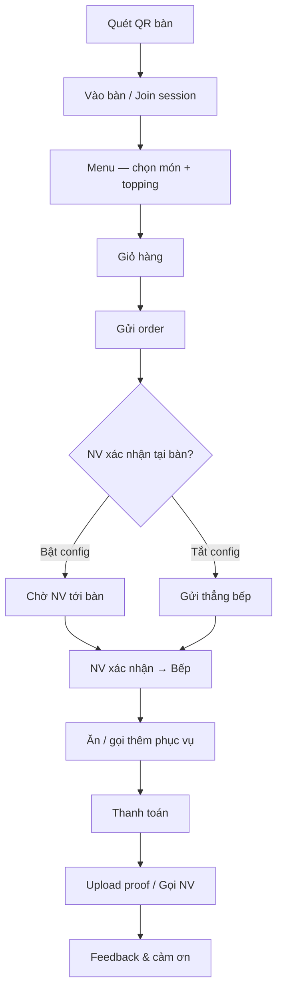
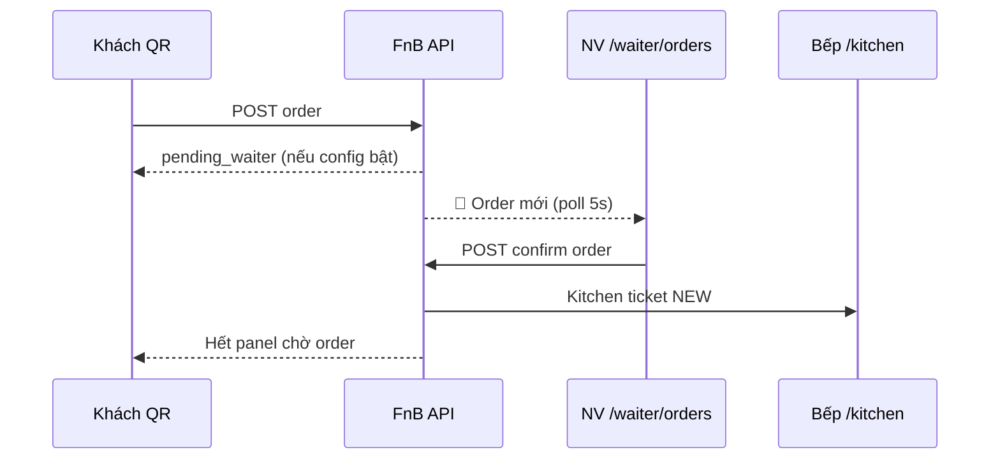
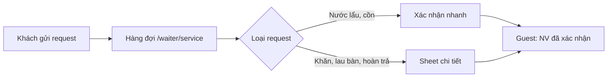
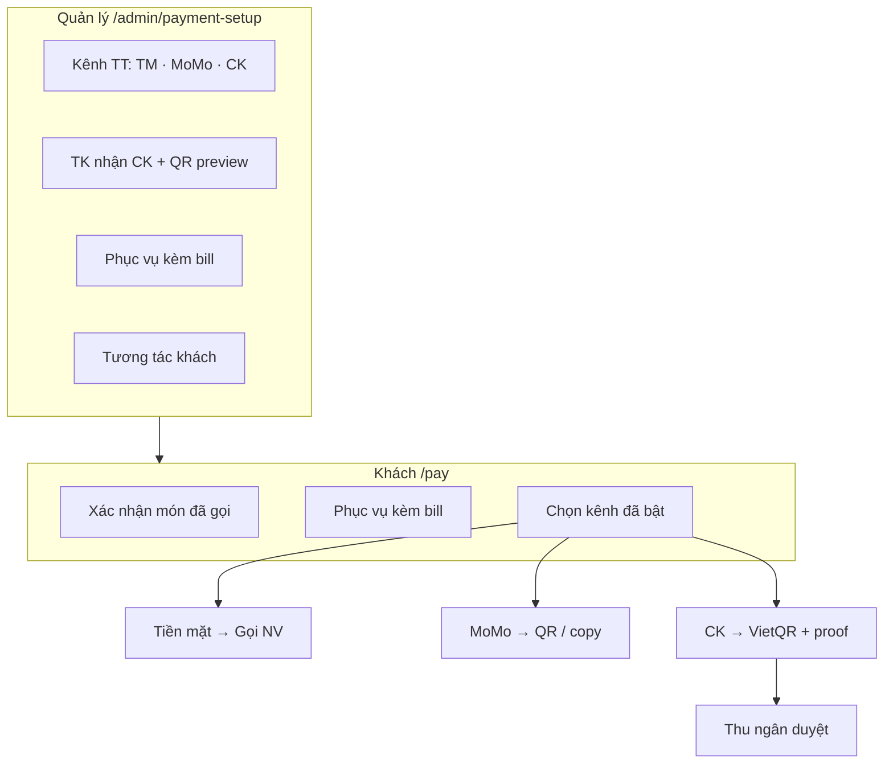

# Linm F&B — Workflow người dùng & Tổng kết giao diện Quản lý

> Pilot: **Lẩu Gà Ngon** · MFE: `@linm/fnb-guest` · `@linm/fnb-waiter` · `@linm/fnb-kitchen` · `@linm/fnb-admin` · `@linm/fnb-reports` · API: `Linm.Web.FnB.WebService`  
> Liên quan: `07-STAFF-SERVICE.md` · `08-QR-PAYMENT.md` · `08b-MOMO-PAYMENT.md` · `05-DASHBOARD.md`

---

## 1. Personas & phạm vi

| Persona | Đăng nhập | MFE / route (pilot dev) | Mục tiêu chính |
|---------|-----------|-------------------------|----------------|
| **Khách (Guest)** | Không — session bàn QR | `Linm.Web.FnB.Guest` · `/g/{tableCode}/…` | Gọi món, gọi phục vụ, thanh toán, đánh giá |
| **Phục vụ (Waiter)** | JWT staff | `Linm.Web.FnB.Waiter` · `/waiter/*` | Xác nhận order, phục vụ request, sơ đồ bàn |
| **Bếp (Kitchen)** | JWT kitchen | `Linm.Web.FnB.Kitchen` · `/kitchen` | Nhận đơn, chế biến, hoàn thành món |
| **Thu ngân (Cashier)** | JWT cashier | `Linm.Web.FnB.Admin` · `/cashier` | Duyệt ảnh CK / xác nhận thanh toán |
| **Quản lý (Manager)** | JWT manager | `Linm.Web.FnB.Admin` · `Linm.Web.FnB.Reports` · `/admin/*` · `/reports/*` | Cấu hình vận hành, xem báo cáo, đánh giá NV |

Khách **không** dùng JWT. Nhân viên và quản lý **bắt buộc** đăng nhập (production). Pilot dev: `yarn start:std` từng MFE.

---

## 2. Workflow khách (Guest QR)

### 2.1 Luồng tổng quát



### 2.2 Các bước chi tiết

| Bước | Màn hình | Hành động khách | Phản hồi hệ thống |
|------|----------|-----------------|-------------------|
| 1 | `/g/{bàn}` | Nhập tên · tạo/join session | Session TTL · mã share join |
| 2 | `/g/{bàn}/menu` | Chọn món (sheet qty + addon) | Giỏ local + badge số lượng |
| 3 | `/g/{bàn}/cart` | **Gửi order** | Toast + panel **Order đang chờ** (nếu bật xác nhận NV) |
| 4 | Cart / Menu | Gọi phục vụ (nước lẩu, khăn, lau bàn…) | Panel **Tiến trình phục vụ** · poll 5s |
| 5 | `/g/{bàn}/pay` | Xác nhận danh sách món · chọn kênh TT | Chỉ hiện kênh admin bật (1–3 tab) |
| 6 | Pay | CK / MoMo / Tiền mặt | QR hoặc gọi NV |
| 7 | `/g/{bàn}/proof` | Gửi ảnh CK (nếu chuyển khoản) | Chờ thu ngân |
| 8 | `/g/{bàn}/feedback` | Sao + ghi chú / form cải thiện (<4 sao) | `/thank-you` |

**Route Guest (pilot):**

```
/g/:tableCode              → Welcome / session
/g/:tableCode/menu         → Thực đơn
/g/:tableCode/cart         → Giỏ & phục vụ
/g/:tableCode/pay          → Thanh toán
/g/:tableCode/proof        → Gửi proof CK
/g/:tableCode/feedback     → Đánh giá
/g/:tableCode/thank-you    → Cảm ơn
```

### 2.3 Trạng thái hiển thị cho khách

| Panel | Khi nào hiện | Trạng thái |
|-------|--------------|------------|
| **Order đang chờ** | Admin bật *NV tới bàn xác nhận món* | `Chờ NV tới bàn` → biến mất khi NV xác nhận |
| **Tiến trình phục vụ** | Có request đang active | `Chờ NV xác nhận` → `NV đã xác nhận` |
| **Phục vụ kèm bill** | Admin cấu hình khăn / đồ ăn nhẹ | Hiện trên màn Pay trước checkbox xác nhận món |
| **Kênh thanh toán** | Theo config admin | 1 kênh = full width · 2–3 kênh = tab co giãn |

---

## 3. Workflow phục vụ (Waiter)

### 3.1 Luồng xác nhận order



| Màn | Route | NV làm gì |
|-----|-------|-----------|
| Ca làm việc | `/waiter` | Tổng quan bàn · order chờ · phục vụ chờ |
| Xác nhận order | `/waiter/orders` | Toast 🔔 · **✓ Xác nhận tại bàn** → gửi bếp |
| Phục vụ | `/waiter/service` | Toast 🔔 · **Đã nhận · đang tới** hoặc sheet chi tiết |
| Sơ đồ bàn | `/waiter/floor` | Trạng thái bàn |
| Dọn bàn | `/waiter/clean` | Hoàn thành task lau bàn |

### 3.2 Luồng gọi phục vụ



| Loại | Nút NV | Sheet |
|------|--------|-------|
| Nước lẩu, cồn/bếp | **✓ Đã nhận · đang tới** | Không |
| Khăn / dụng cụ | Xác nhận phục vụ | Số khăn · bộ dụng cụ |
| Lau bàn | Xác nhận phục vụ | Scan/chọn bàn |
| Hoàn trả món | Xác nhận hoàn trả | Danh sách món trả |
| Thanh toán | → Thu ngân | — |

Poll + toast: mỗi **5 giây** trên `/waiter/orders` và `/waiter/service`.

---

## 4. Bếp & Thu ngân (tóm tắt)

| Vai trò | Route | Trigger từ workflow khách |
|---------|-------|---------------------------|
| **Bếp** | `/kitchen` | NV xác nhận order → ticket `NEW` → Nhận đơn → Xong |
| **Thu ngân** | `/cashier` | Khách gửi proof CK · gọi đối soát · MoMo manual |

Dashboard quản lý liên kết: **Đơn bếp chờ** → `/kitchen` · **Chờ xác nhận CK** → `/cashier`.

---

## 5. Workflow thanh toán (khách ↔ quản lý ↔ thu ngân)



Chi tiết kỹ thuật: `08-QR-PAYMENT.md` · `08b-MOMO-PAYMENT.md`.

**Mặc định pilot:** chỉ **Chuyển khoản** bật; MoMo / Tiền mặt tắt cho đến khi quản lý bật.

---

## 6. Tổng kết qua giao diện Quản lý

Quản lý **không** tham gia từng bước phục vụ tại bàn — mà **cấu hình** hành vi toàn hệ thống và **giám sát** qua dashboard / báo cáo.

### 6.1 Bản đồ menu Quản lý

| Tab / Route | Màn hình | Ai dùng | Liên kết workflow |
|-------------|----------|---------|-------------------|
| **Tổng quan** | `/admin/dashboard` | Manager | Stat: bàn đang phục vụ · bếp chờ · CK chờ · link nhanh |
| **QR TT** | `/admin/payment-setup` | Manager | **Trung tâm cấu hình** guest + thanh toán (§6.2) |
| **Menu** | `/admin/menu` | Manager | SKU · giá · addon → Guest menu |
| **Chi nhánh** | `/admin/branches` | Owner | Multi-branch · timezone |
| **NV** | `/admin/staff` | Manager | Đánh giá · điểm ca 60/40 |
| **Báo cáo** | `/reports/*` | Manager | Doanh thu · CK · món bán chạy |

**Dev:** `Linm.Web.FnB.Admin` · `yarn start:std` → `/admin/dashboard`.

### 6.2 `/admin/payment-setup` — Cấu hình → Hành vi khách/NV

Đây là màn **tổng hợp** các policy vận hành pilot. Thứ tự trên UI:

#### (A) Tương tác khách hàng — **lưới dòng** (STT · Tùy chọn · Bật)

| Checkbox admin | API | Mặc định | Ảnh hưởng |
|----------------|-----|----------|------------|
| **Order — NV tới bàn xác nhận món** | `guest-interaction.orderWaiterConfirmRequired` | Bật | Bật: khách thấy panel chờ · NV `/waiter/orders` · quota order. Tắt: gửi thẳng bếp |
| **Phục vụ — NV nhận thông báo và xác nhận** | `guest-interaction.serviceStaffAckRequired` | Bật | Bật: request `pending` → NV toast + xác nhận → khách `NV đã xác nhận`. Tắt: auto-confirm server |

```
GET/PUT /web-bff/api/v1/fnb/admin/guest-interaction
GET     /web-bff/api/v1/fnb/guest/guest-interaction
```

#### (B) Kênh thanh toán khách — **lưới dòng** (Tiền mặt · MoMo · CK)

| Checkbox | API field | Mặc định | Ảnh hưởng Guest `/pay` |
|----------|-----------|----------|-------------------------|
| Tiền mặt | `cashEnabled` | Tắt | Tab + Gọi thanh toán NV |
| MoMo | `momoEnabled` | Tắt | Tab QR / copy ví |
| Chuyển khoản | `bankEnabled` | **Bật** | Tab VietQR · proof |

Layout tab: **1 kênh** = ẩn tab · **2–3 kênh** = grid 2–3 cột.

```
GET/PUT /web-bff/api/v1/fnb/admin/payment-methods
GET     /web-bff/api/v1/fnb/guest/payment-methods
```

#### (C) Tài khoản nhận CK + Preview QR — **lưới dòng TK**

| Thành phần | Mục đích workflow |
|------------|-------------------|
| **SearchInput ngân hàng** (12 NH §08-QR-PAYMENT · BIN NAPAS) | Chọn VCB/TCB/… thay dropdown |
| STK · Chủ TK · **Kích hoạt** (nhiều TK active cùng lúc) | Guest VietQR = TK active đầu tiên |
| + Thêm / Sao chép dòng | Nhiều TK chi nhánh |
| Preview QR | Kiểm tra ND `BAN{bàn} {tên}` trước go-live |
| Lưu tài khoản | `POST/PUT payment-setup` |

#### (D) Phục vụ kèm bill (xác nhận thanh toán)

| Cấu hình | Workflow khách |
|----------|----------------|
| Khăn lạnh theo số người | Pay: `Khăn × N` (N = số khách bàn) |
| Đồ ăn nhẹ / phụ phí (lưới dòng: STT · Bật · Tên · Loại phí · Đơn giá) | Pay: từng dòng + badge **Miễn phí** / **Có phí** — không có trên menu gọi |

```
GET/PUT /web-bff/api/v1/fnb/admin/bill-defaults
  complimentarySnacks[]: { id, name, enabled, isComplimentary, unitPrice }
GET     /web-bff/api/v1/fnb/guest/tables/{table}/bill-summary
  billExtraItems[]: { id, name, isComplimentary, unitPrice }
```

### 6.3 Dashboard — Giám sát realtime (pilot poll)

| Widget `/admin/dashboard` | Ý nghĩa vận hành | Hành động manager |
|---------------------------|-------------------|-------------------|
| **Đang phục vụ** | Số bàn có session/order | Theo dõi ca cao điểm |
| **Đơn bếp chờ** | Ticket chưa PREP/DONE | Link → `/kitchen` |
| **Chờ xác nhận CK** | Proof chưa duyệt | Click → `/cashier` |
| **Báo cáo doanh thu** | — | → `/reports/revenue` |

### 6.4 Ma trận: Config quản lý → Trải nghiệm user

| Quản lý cấu hình | Khách thấy | NV thấy | Ghi chú |
|------------------|------------|---------|---------|
| Tắt xác nhận order NV | Không panel chờ order | Ít item `/waiter/orders` | Order vào bếp ngay |
| Bật xác nhận order NV | Panel vàng *Order đang chờ* | Toast + danh sách order | Chuẩn F&B cao cấp |
| Tắt ack phục vụ | Request gần như instant confirmed | Ít item `/waiter/service` | Quán tự phục nhanh |
| Bật ack phục vụ | *Chờ NV xác nhận* → *Đã xác nhận* | Toast 🔔 + nút xác nhận | Chuẩn pilot |
| Chỉ bật CK | Pay: full width QR ngân hàng | Thu ngân duyệt proof | **Mặc định pilot** |
| Bật thêm MoMo + TM | 3 tab co giãn | NV gọi thu TM / đối soát MoMo | Linh hoạt quán |
| Khăn + đồ ăn nhẹ | Block trên Pay | — | Marketing / chuẩn phục vụ |
| Menu `/admin/menu` | Món · addon trên QR | — | Content team |

### 6.5 Checklist go-live (manager)

1. **Tương tác khách** — chọn có/không NV xác nhận tại bàn (order + phục vụ).
2. **Kênh TT** — bật đúng TM / MoMo / CK quán thực tế nhận.
3. **TK CK + Preview QR** — test 1 giao dịch thật ND chuyển khoản.
4. **Phục vụ kèm bill** — khăn theo người · món welcome.
5. **Menu** — giá · addon · emoji pilot.
6. **Training NV** — `/waiter/orders` + `/waiter/service` + toast 5s.
7. **Dashboard** — ca pilot theo dõi bếp + CK.

---

## 7. API pilot (tham chiếu nhanh)

| Workflow | Guest API | Admin / Waiter API |
|----------|-----------|-------------------|
| Session / order | `POST …/orders` · `GET …/orders/pending` | `GET /waiter/orders-pending` · `POST …/confirm` |
| Phục vụ | `POST/GET …/service-requests` | `GET /waiter/service-requests` · `POST …/confirm` |
| Tương tác config | `GET /guest/guest-interaction` | `GET/PUT /admin/guest-interaction` |
| Thanh toán | `GET …/payment-info` · `…/momo-payment-info` | `GET/PUT /admin/payment-methods` · `payment-setup` |
| Bill kèm | `GET …/bill-summary` | `GET/PUT /admin/bill-defaults` |

Prefix: `/web-bff/api/v1/fnb/…`

---

## 8. Demo & tài liệu liên quan

| Tài liệu | Nội dung |
|----------|----------|
| `01-PLATFORM-OVERVIEW.md` | Nguyên tắc nền tảng |
| `07-STAFF-SERVICE.md` | NV · feedback · quota |
| `08-QR-PAYMENT.md` · `08b-MOMO-PAYMENT.md` | CK · MoMo |
| `05-DASHBOARD.md` | Báo cáo · embed |
| `app-demo.html` | Prototype tương tác |
| `index.html` | Pitch khách hàng |

**Chạy pilot local:** Guest `:910x` · Staff `:910x` · API Docker `Linm.Web.FnB.WebService`.
